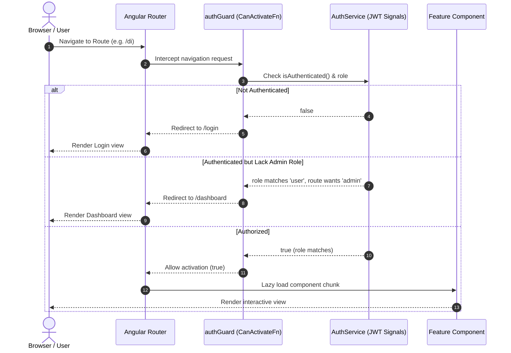

# AngularFeatureShowcase 🚀

A premium, state-of-the-art Angular reference application demonstrating enterprise-grade architectural design patterns, modern reactive paradigms, and best practices.

This codebase serves as a comprehensive training environment and production-ready template for Angular developers, utilizing **Strict TypeScript**, **Standalone Components**, **Angular Signals**, **RxJS Streams Concurrency control**, and **Vitest testing pipelines**.

---

## 📖 Table of Contents
1. [Architectural Diagram](#1-architectural-diagram)
2. [Project Structure](#2-project-structure)
3. [Key Angular Concepts Demonstrated](#3-key-angular-concepts-demonstrated)
4. [Design Decisions & Modern Naming Convention](#4-design-decisions--modern-naming-convention)
5. [Getting Started & Local Execution](#5-getting-started--local-execution)
6. [Common Pitfalls & Anti-Patterns to Avoid](#6-common-pitfalls--anti-patterns-to-avoid)
7. [Angular Interview Preparation Guide](#7-angular-interview-preparation-guide)

---

## 1. Architectural Diagram

### Route & Auth Guard Pipeline Flow
This diagram illustrates how navigation is checked via the functional `authGuard` using simulated JWT roles before lazy loading components:



### HTTP Client Interceptor Pipeline
All REST operations pass through a functional interceptor pipeline to attach tokens, log latency, and format errors:


---

## 2. Project Structure

Adhering to the modern 2025 naming guidelines, the project structure is flat, concise, and structured strictly around domain layers:

```text
d:/learning/angular-feature-showcase
├── public/                    # Static assets
└── src/
    ├── main.ts                # Application bootstrapper
    ├── material-theme.scss    # Custom Material 3 Dark theme configurations
    ├── styles.css             # Global styling sheet (Custom scrollbars, codes, tables)
    └── app/
        ├── app.ts             # Root Layout Shell Component
        ├── app.html           # Root template featuring sidebar & drawer views
        ├── app.css            # Root layout styling
        ├── app.config.ts      # Global configurations & DI token registers
        ├── app.routes.ts      # Lazy-loaded route map & child paths
        │
        ├── core/              # Global Singletons (guards, errors, interceptors)
        │   ├── auth/          # JWT simulated authentication services & guards
        │   ├── errors/        # Global runtime Exception Handlers
        │   ├── interceptors/  # Functional Http Request/Response middleware
        │   ├── services/      # Global BehaviorSubject logger database
        │   └── tokens.ts      # Scoped injection tokens (APP_CONFIG, API_URL)
        │
        ├── shared/            # Reusable UI widgets and custom directives/pipes
        │   ├── components/    # Content projection components (Card)
        │   ├── directives/    # Custom Structural (*appUnless) & Attribute directives
        │   └── pipes/         # Custom sorting, truncation, and memoization pipes
        │
        └── features/          # Lazy-Loaded Module Features
            ├── login/         # Role-based credential check views
            ├── dashboard/     # Metric reports containing SVG architecture maps
            ├── fundamentals/  # Sub-pages: parent-child, viewchildren, templateref, projection
            ├── databinding/   # Two-way sync, property togglers, trackers
            ├── directives-pipes/ # Loop managers, formatting showcases
            ├── di/            # Scoped feature services, DI lookup tables
            ├── control-flow/  # Native template control flow directives (@if, @for, @switch, @empty)
            ├── dynamic-comp/  # Programmatic & declarative component mounting labs
            ├── security-demo/ # Sanitization bypass playground (DomSanitizer)
            ├── animations/    # Trigger-based state and staggered list animations
            ├── routing-demo/  # Dynamic path readers, resolvers
            ├── forms-demo/    # FormArrays, async availability validations
            ├── http-demo/     # Live REST API CRUD transactions
            ├── rxjs-demo/     # switchMap, mergeMap, concatMap concurrency labs
            ├── state-demo/    # BehaviorSubject store with Undo/Redo history
            ├── lifecycle/     # Chronological trace tracking logs
            ├── change-detection/ # Default vs OnPush rendering benchmark comparisons
            ├── signals-demo/  # signal(), computed(), and effect() calculator
            └── performance/   # CDK Virtual Scroll, trackBy, Pure Pipe memoize
```

---

## 3. Key Angular Concepts Demonstrated

### ⚡ 1. Signals Studio (`/signals-demo`)
- Fine-grained reactivity using `signal()` read-write values.
- Automatic caching and evaluation of derived states via `computed()`.
- Handled side-effects and console log streams inside `effect()`.
- Mutating arrays immutably via `.update(arr => [...arr, item])`.
- Direct comparison showing why signals are subscription-free and avoid memory leaks.

### 🔄 2. RxJS Streams Laboratory (`/rxjs-demo`)
- Dynamic click stream mapping.
- Visualizing flattening map operator behaviors in real-time:
  - `switchMap`: Cancels previous pending operations on new emissions.
  - `mergeMap`: Run operations in parallel, completing all requests.
  - `concatMap`: Queue requests to run sequentially.
  - `exhaustMap`: Ignore new events until the active execution completes.
- Late-subscriber cache differences between `Subject`, `BehaviorSubject`, and `ReplaySubject`.
- Event filtering using `debounceTime` and `distinctUntilChanged`.

### ⏱️ 3. Component Lifecycle Auditor (`/lifecycle`)
- Real-time logging of component hooks.
- Execution sequence tracing:
  1. `ngOnChanges` (fires when inputs change reference)
  2. `ngOnInit` (compilation initialization)
  3. `ngDoCheck` (custom change tracking)
  4. `ngAfterContentInit` / `Checked` (projected slot binding)
  5. `ngAfterViewInit` / `Checked` (template HTML rendering complete)
  6. `ngOnDestroy` (unmounting cleanup)

### 📊 4. Change Detection Benchmarker (`/change-detection`)
- Side-by-side execution trace between `Default` (CheckAlways) and `OnPush` (CheckOnce) components.
- Template execution counter `{{ checkRender() }}` visually showing how many times Angular re-evaluates views.
- Demonstrates how `OnPush` remains quiet during parent-only state changes.
- Manual verification of `ChangeDetectorRef.markForCheck()` and local click events.

### 🏎️ 5. Performance Optimization Suite (`/performance`)
- **CDK Virtual Scroll**: Render only ~15 nodes for a list of 10,000 items, keeping DOM footprints lightweight and scroll frames smooth.
- **trackBy DOM Matching**: Matches elements by unique identifier `id` instead of reference. Witness the DOM layout redraws (red flashing) disappear when `trackBy` is enabled.
- **Pure Pipe Caching**: Proves how memoization via pure pipes caches CPU-intensive computations (e.g. checking prime factors), preventing calculations from firing on every mouse movement.

### 🧩 6. Dependency Injection & Custom Providers (`/di`)
- **Value Provider**: `APP_CONFIG` injecting configurations, `API_URL` injecting URLs.
- **Factory Provider**: `LOGGER_CONFIG` computing custom headers or levels.
- **Class Provider**: Intercepting Angular's standard `ErrorHandler` with a custom `GlobalErrorHandler` to display error notifications.
- **Scoped/Local Provider**: `ScopedFeatureService` registered on component level to demonstrate hierarchical DI scopes.
- **Resolution Modifiers**: Constructor injection modifiers (`@Self`, `@SkipSelf`, `@Optional`) altering injection resolution tree paths.

### 📋 7. Forms Studio (`/forms-demo`)
- Advanced nested Reactive Forms.
- Dynamic fields generated dynamically from configurations.
- FormArrays managing variable lists of inputs.
- Custom async validation verifying username availability with HTTP-like delays.
- Performance optimization: `updateOn: 'blur'` triggering validation only on focus lost.

### 🔀 8. Modern Control Flow Arena (`/control-flow`)
- Native template syntax (`@if`, `@else`, `@for`, `@switch`, `@case`) introduced in Angular 17.
- **@empty block**: Rendering automatic placeholder UI when list queries contain zero items.
- Built-in type-narrowing and optimization bypassing legacy `CommonModule` dependencies.

### 🧩 9. Dynamic Components Lab (`/dynamic-components`)
- Declarative components loading using `[ngComponentOutlet]`.
- Imperative lifecycle mounting via `ViewContainerRef.createComponent()`.
- Capturing programmatically created component outputs and binding reactive inputs in TypeScript.

### 🔒 10. Security & Sanitization Lab (`/security`)
- Default cross-site scripting (XSS) auto-escaping patterns.
- Contextual sanitization of HTML, style rules, and URL redirects.
- Sanitization bypass configurations via `DomSanitizer` trust methods (`bypassSecurityTrustHtml`, `bypassSecurityTrustResourceUrl`).

### 🎬 11. Animations Arena (`/animations`)
- State triggers defining CSS transformations (e.g. morphing heights, colors, and bounds).
- Transition interpolation using standard cubic-bezier timing curves.
- Multi-element staggered transitions and entrance list timings using `:enter`, `:leave`, `query`, and `stagger`.

---

## 4. Design Decisions & Modern Naming Convention

This application utilizes modern Angular guidelines:
1. **Concise Naming Convention**:
   File naming has been simplified to omit type-identifiers (`.component`, `.service`, `.directive`, `.pipe`, `.guard`) from files, yielding cleaner import paths:
   - Component: `app.ts` (instead of `app.component.ts`)
   - Route Guard: `auth-guard.ts` (instead of `auth.guard.ts`)
   - Service: `logging.ts` (instead of `logging.service.ts`)
   - Pipe: `truncate.ts` (instead of `truncate.pipe.ts`)
2. **Circular DI Dependency Prevention**:
   The `GlobalErrorHandler` is registered at bootup. Direct constructor injection of services like `LoggingService` causes circular DI errors. This is solved by dynamically retrieving the dependency via the `Injector` instance:
   ```typescript
   const logger = this.injector.get(LoggingService);
   ```
3. **Route Component Input Binding**:
   Registered using `withComponentInputBinding()` in `provideRouter()`. Path parameters (e.g. `:id`) and resolved data are bound directly to `@Input()` decorators, eliminating verbose `ActivatedRoute` subscription setups.

---

## 5. Getting Started & Local Execution

### Prerequisites
- Node.js (v18.x or later)
- npm (v9.x or later)

### Installation
Clone the repository and install dependencies:
```bash
npm install
```

### Running Local Development Server
Start the Angular dev server:
```bash
npm run start
```
Navigate to `http://localhost:4200/`. Log in using any credentials matching the roles:
- **Username**: `admin` / **Password**: `admin123` (Admin Role)
- **Username**: `user` / **Password**: `user123` (User Role)

### Running Vitest Unit Tests
To run tests headlessly:
```bash
npm run test
```

### Compilation Build Check
Verify build targets compile:
```bash
npm run build
```

---

## 6. Common Pitfalls & Anti-Patterns to Avoid

### ❌ Calling Functions Inside Templates
- **Pitfall**: Rendering data using `<span>{{ getStatus(item) }}</span>`.
- **Reason**: Angular evaluates template functions on *every* change detection cycle. If the function contains complex logic, it freezes the main thread.
- **Solution**: Use a **Pure Pipe** (which caches results based on arguments) or compute values beforehand and store them in properties.

### ❌ Memory Leaks from Subscriptions
- **Pitfall**: Manually subscribing to HTTP requests or state streams in `ngOnInit()` without unsubscribing.
- **Reason**: Subscriptions remain in memory even after the component is destroyed, leaking memory.
- **Solution**: Use the `async` pipe in templates, which auto-unsubscribes, or handle streams via **Angular Signals**, which do not require subscriptions.

### ❌ Mutating State Objects Directly
- **Pitfall**: Doing `state.items.push(newItem)` in a store service.
- **Reason**: Mutating arrays/objects directly keeps the same object reference, preventing `OnPush` components from detecting updates.
- **Solution**: Mutate states immutably: `state.items = [...state.items, newItem]`.

---

## 7. Angular Interview Preparation Guide

### Q1: What is the difference between `detectChanges()` and `markForCheck()`?
- **`detectChanges()`** forces change detection to run immediately on the component and its children. It runs synchronously.
- **`markForCheck()`** does not run change detection. Instead, it marks the path from the component to the root as dirty, telling Angular to check it during the next global change detection cycle.

### Q2: How do Angular Signals improve rendering performance over Zone.js?
- **Zone.js** intercepts asynchronous browser events and triggers a top-down change detection sweep across the entire component tree, checking every node.
- **Angular Signals** establish a direct reactive dependency graph. When a signal changes, Angular knows exactly which components depend on that value and updates *only* those nodes, eliminating top-down tree sweeps.

### Q3: What are pure and impure pipes in Angular?
- **Pure Pipes** are stateless. Angular only executes a pure pipe's `transform` method when its input arguments change reference (primitives value change, or object reference changes). It caches values.
- **Impure Pipes** run on every change detection cycle, regardless of input changes. Used for stateful things like the `async` pipe.

### Q4: When would you use a Resolver in Angular routing?
- A **Resolver** is used to pre-fetch API data before a route activates. This avoids rendering blank templates or loading spinner skeletons, as the router waits for the resolver to resolve before transitioning to the route.

### Q5: What is the new control flow in Angular and how does it compare to *ngIf / *ngFor?
- Angular 17 introduced a native compiler-based control flow (`@if`, `@for`, `@switch`).
- **Performance**: It compiles to native javascript conditional checks, outperforming directive-based execution by up to 90%.
- **Bundle Size**: It requires zero module imports (unlike `CommonModule` or `NgIf` / `NgFor`).
- **Features**: Includes `@empty` support in `@for` loops to handle empty collections automatically.

### Q6: How does non-destructive Hydration work in Angular SSR?
- Legacy SSR destroys client-side DOM nodes rendered by the server and redraws them from scratch.
- **Hydration** matches active client components to existing DOM structures rendered by the server, attaching event listeners and setting up change detection without deleting or recreating elements, eliminating layout flicker.

---
*Developed by **Antigravity** — Designed for code excellence and premium UX/UI architecture.*
